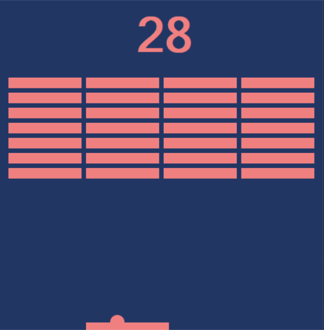
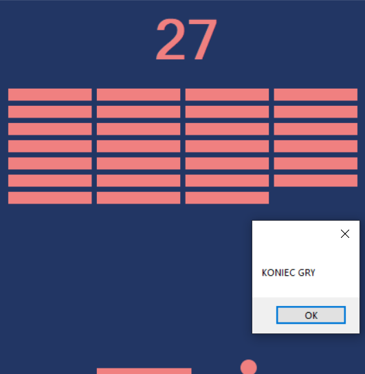

# Breakout game
> A breakout game made for University assignment purposes 

## Table of contents
* [General info](#general-info)
* [Screenshots](#screenshots)
* [Technologies](#technologies)
* [Setup](#setup)
* [Code Examples](#code-examples)
* [Status](#status)
* [Inspiration](#inspiration)
* [Contact](#contact)

## General info
A simple breakout game made during 1st semester for the final assignment. 

## Screenshots
  


## Technologies
* Visual Studio Forms

## Setup
To install this application you'll need to clone this repositary and open in Visual Studio. 

## Code Examples
Game over; disappearing boxes; the ability of movement of the ball:
```c#
        private void pion_Tick(object sender, EventArgs e)
        {          
            if(pilka.Top < 10 )
                pionowo++; 
            else if (pilka.Top > this.Height - pilka.Height - deska.Height - 35)
            {
                if (pilka.Left<(deska.Left) || (pilka.Left + pilka.Width)>(deska.Left + deska.Width+5))
                {
                    pion.Enabled = poziom.Enabled = false;
                    MessageBox.Show("KONIEC GRY");
                }

                pionowo--;
            }
            pilka.Top += (pionowo * speed);

            int _wynik = 0;
            foreach (Control x in this.Controls)
                if (x is PictureBox && x.Tag == "block")
                {
                    if (pilka.Bounds.IntersectsWith(x.Bounds))
                    {

                        this.Controls.Remove(x);
                        pionowo = -pionowo;
                    }
                    _wynik++;
                    wynik.Text = Convert.ToString(_wynik);
                }
        }
```


## Status
Project is: _finished_ 

## Inspiration
Add here credits. Project based on the University of Gdańsk classes

## Contact
Created by [@jcieszynska](https://www.github.com/jcieszynska) - feel free to contact me!
